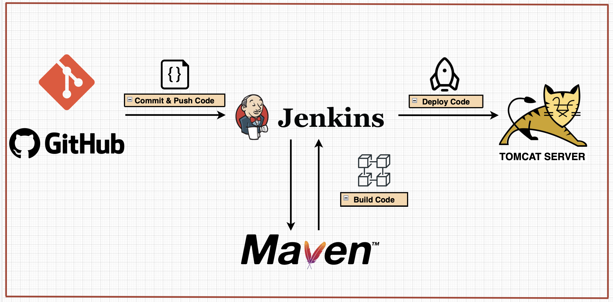
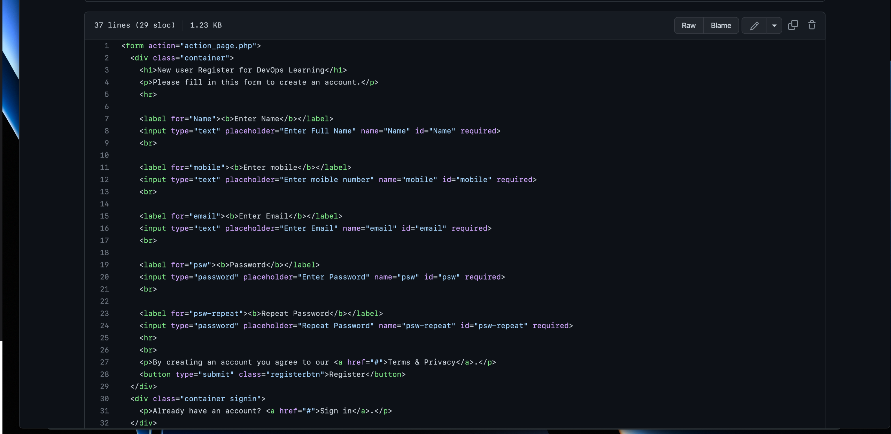
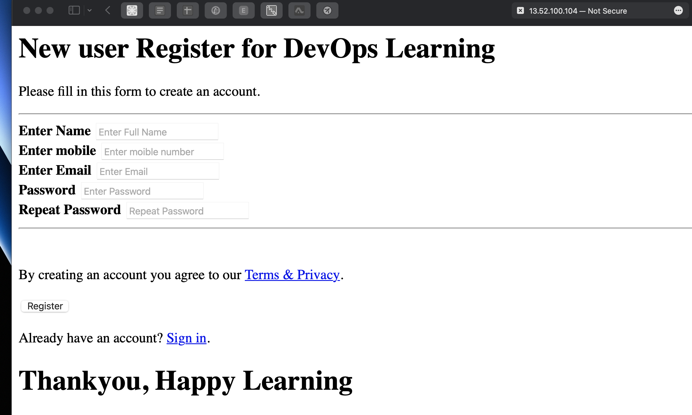
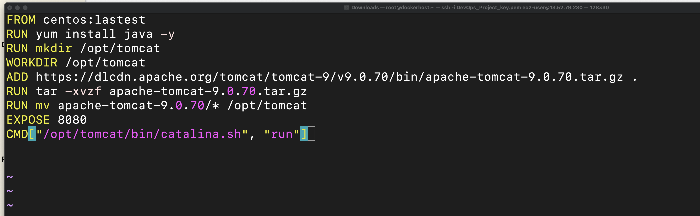
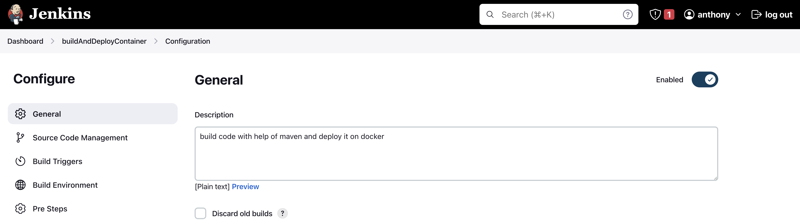

# FULL DevOps pipeline project | CI/CD | Jenkins | Ansible | Kubernetes 

### Learning Objectives:
1. DevOps
2. Continuous Integration
3. Continuous Delivery

### Technologies and Protocols:
* Jenkins 
* Ansible
* Kubernetes
* Docker

### What the heck is DevOps?
- A consistent streamline and manageable pipeline for software development and delivery 
- Continuous integration and continuous development and continuous testing
- Development and operational teams working cohesively - no more silos!

## Overview:
There are two main parts to this project:
1. Continuous Integration (CI): the practice of merging all developers' working copies to a shared mainline several times a day. Every revision that is committed triggers an automated build and test.
* Step-by-step overview of CI:
    - We update source code on local workstation > we commit the code onto Github repository > Jenkins pulls the code and, with the help of Maven, builds WAR file (build artifacts); Jenkins *pushes* WAR file onto Ansible > Ansible-playbook creates image from WAR file and *commits* it onto docker hub 

2. Continuous Delivery (CD): software engineering approach in which teams produce software in short cycles, ensuring that the software can be reliably released at any time. A practice that uses automation to speed the release of new code.
* Step-by-step overview of CD:
    - After Jenkins NEW image build is successful we can trigger a CD job > Ansile-playbook uses updated image and *pushes* it onto a Kubernetes cluster for end-user access.

> What we are trying to accomplish with DevOps is how can we EFFICIENTLY, EFFORTLESSLY and AUTOMATICALLY update new software to end-users.
 

### Continuous Integration (CI)

We can edit and commit new changes on GitHub > after, we can run it through Jenkins (“Build Now” to create and push new artifacts - *we can automate this as well!*) and see live updates on the Tomcat server - Maven helps with error checks and simplifying source code. Jenkins and Maven work together to create a SOLID source code foundation to work on. 

A lot of the steps involved setting up and configuring each piece of the environment (software engineer / software architect), also creating admin users and key pairs. I needed to download and configure plugins; plus, I needed to configure variables on the servers to make my life easier (a lot of administrative tasks).But after the initial setup, up I see how streamlines this automatic integration can be absolutely crucial in software development.  Even if the pieces of software to run checks and deploy the code is different, the end goals remains the same: find and address bugs quicker, improve software quality AND reduce the time it takes to validate and release new updates.

## Dockerfile for production environment 
- Infrastructure as code? - we can create a file with instructions to run on all of our containers to automate the production environment. 
- Lists of steps docker will run to create our production environment - saves us time!
- `docker build` build an image with dockerfile instructions

## Integrate Docker with Jenkins 
- Create a dockeradmin user `useradd`
- Install “Publish over SSH” plugin 
    - Send build artifacts over SSH to docker
- Add docker host to Jenkins “confirm system”
    - Open communication lines between the two
    - Add dockeradmin as an SSH server into Jenkins 

>build code with help of maven and deploy it on docker

## Copy new .WAR file (build artifact) into Dockerfile + pull latest image FROM tomcat = our production IMAGE
- ORGANIZATION IS KEY - folder organization and standard naming convention goes a long way. Make sure each file has proper permissions and just enough to do one’s job.
- We save out our new .WAR file - build artifact - onto our local machine to integrate it in our Dockerfile. 
- **This will automate build and deployment - on the Docker container**

