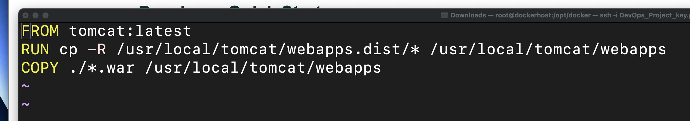
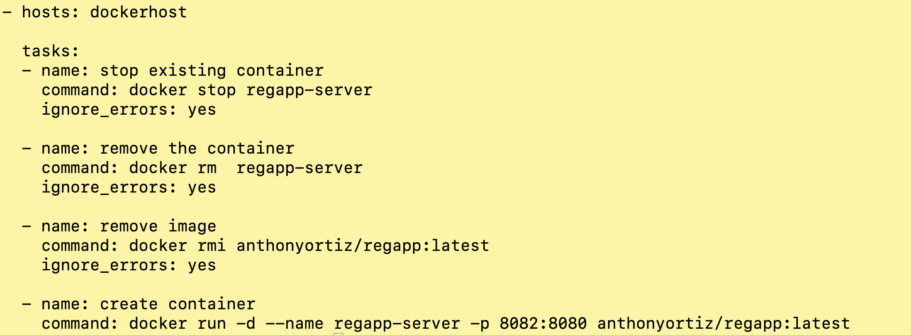

# FULL DevOps pipeline project | CI/CD | Jenkins | Ansible | Kubernetes 

### Learning Objectives:
1. DevOps
2. Continuous Integration
3. Continuous Delivery

### Technologies and Protocols:
* Jenkins 
* Ansible
* Kubernetes
* Docker

### What the heck is DevOps?
- A consistent streamline and manageable pipeline for software development and delivery 
- Continuous integration and continuous development and continuous testing
- Developmental and operational teams working cohesively - no more silos!

## Overview:
There are two main parts to this project:
1. Continuous Integration (CI): the practice of merging all developers' working copies to a shared mainline several times a day. Every revision that is committed triggers an automated build and test.
* Step-by-step overview of CI:
    - We update source code on local workstation > we commit the code onto Github repository > Jenkins pulls the code and, with the help of Maven, builds WAR file (build artifacts); Jenkins *pushes* WAR file onto Ansible > Ansible-playbook creates image from WAR file and *commits* it onto docker hub 

2. Continuous Delivery (CD): software engineering approach in which teams produce software in short cycles, ensuring that the software can be reliably released at any time. A practice that uses automation to speed the release of new code.
* Step-by-step overview of CD:
    - After Jenkins NEW image build is successful we can trigger a CD job > Ansile-playbook uses updated image and *pushes* it onto a Kubernetes cluster for end-user access.

> What we are trying to accomplish with DevOps is how can we EFFICIENTLY, EFFORTLESSLY and AUTOMATICALLY update new software to end-users.
 

### Continuous Integration (CI)

We can edit and commit new changes on GitHub > after, we can run it through Jenkins (“Build Now” to create and push new artifacts - *we can automate this as well!*) and see live updates on the Tomcat server > Maven helps with error checks and simplifying source code. Jenkins and Maven work together to create a SOLID source code foundation to work on. 

A lot of the steps involved setting up and configuring each piece of the environment (software engineer / software architect), also creating admin users and key pairs. I needed to download and configure plugins; plus, I needed to configure variables on the servers to make my life easier (a lot of administrative tasks).But after the initial setup, up I see how streamlines this automatic integration can be absolutely crucial in software development.  Even if the pieces of software to run checks and deploy the code is different, the end goals remains the same: find and address bugs quicker, improve software quality AND reduce the time it takes to validate and release new updates.

## Dockerfile for production environment 
- Infrastructure as code? - we can create a file with instructions to run on all of our containers to automate the production environment. 
- Lists of steps docker will run to create our production environment - saves us time!
- `docker build` build an image with dockerfile instructions

> Docker File
>1. FROM - to pull the base image
>2. RUN - to execute commands 
>3. CMD - to provide defaults for an executing container
>4. ENTRYPOINT - to configure a container that will run as an executable 
>5. WORKDIR - sets working directory
>6. COPY - copy a directory from your local machine to the docker container
>7. ADD - copy the files from local machine to docker containers
>8. EXPOSE - informs docker what port a container is listening on 
>9. ENV - set environment variables 

## Integrate Docker with Jenkins 
- Create a dockeradmin user `useradd`
- Install “Publish over SSH” plugin 
    - Send build artifacts over SSH to docker
- Add docker host to Jenkins “confirm system”
    - Open communication lines between the two
    - Add dockeradmin as an SSH server into Jenkins 

>build code with help of maven and deploy it on docker

## Copy new .WAR file (build artifact) into Dockerfile + pull latest image FROM tomcat = our production IMAGE
- ORGANIZATION IS KEY - folder organization and standard naming convention goes a long way. Make sure each file has proper permissions and just enough to do one’s job.
- We save out our new .WAR file - build artifact - onto our local machine to integrate it in our Dockerfile. 
- **This will automate build and deployment - on the Docker container**

### Continuous Delivery (CD)
##Ansible
- Ansible is a suite of software tools that enables infrastructure as code. It can be used to provision the underlying infrastructure of your environment.
- Jenkins sends artifacts over to Ansible > creates images and deploys containers. Ansible pushes images onto Docker Hub and deploys containers onto Docker.

## Prepare Ansible server
- Setup EC2 instance
- Setup hostname
- Create ansadmin user
- Add user to sudoer
- Generate SSH keys
- Enable password based login
- Install Ansible

## 14: Integrate DockerHost with Ansible
- On docker host:
    - Create ansadmin
    - Add ansadmin to sudoers
    - Enable password based login
- On Ansible node:
    - Add to host file 
    - Copy SSH keys - password-less authentication
    - Test connection - [ansadmin@ansible-server home]$ `ansible all -m ping`

## 15: integrate Ansible with Jenkins
- Add ansible-server onto Jenkins - publish over SSH
- *Ansible playbook* -  ‘exec command’ equivalent on Jenkins 

> More administrative tasks: integrate and open lines of communications between services.
Instead of sending build artifacts directly onto docker-host, we can send them to Ansible. Ansible acts as our dedicated deployment tool by sending images / containers to docker. Ansible sits between Jenkins and Docker.

## 16: Ansible: Build Docker images / containers
- After “building” code on Jenkins, we should see .WAR artifact on ansible-server
- Create (copy / paste) Dockerfile into /opt/docker/ on ansible-server
- [root@ansible-server docker]# `docker build -t reapp:v1 .` create image
- [root@ansible-server docker]# `docker run -t --name regapp-server -p 8081:8080 regapp:v1` create container using image

> Both image and container sit in our ansible-server, but to deploy to end-users we need to send image / container to Docker.

## 17: Create Ansible playbook
- *An Ansible playbook is an organized unit of scripts that defines work for a server configuration managed by the automation tool Ansible.*
- Playbook comes in a .yaml format: *Designed for human interaction, YAML is a strict superset of JSON, another data serialization language. But because it's a strict superset, it can do everything that JSON can and more.*
- Use Ansible to Push IMAGE onto docker hub 
    - Playbook creates NEW image
    - Push image onto DockerHub - can be made public or private

## 18: update Ansible playbook 
- `[ansadmin@ansible-server docker]$ ansible-playbook regapp.yml` 
- Integrate playbook into Jenkins - when updating source code, run playbook aka “exec command” on Jenkins

## TROUBLESHOOTING
I was receiving this error when executing build:

`ERROR: Exception when publishing, exception message [Exec exit status not zero. Status [1]]
  Build step 'Send files or execute commands over SSH' changed build result to UNSTABLE
  Finished: UNSTABLE`

I began to backtrack:
1. ‘Send files or execute commands over SSH' > I checked the configurations on the build project. Everything checked out.
2. I checked /opt/docker/ and saw that I was updating my image. No issue there.
3. I checked docker hub and realized the image was not updating > I copied `docker push anthonyortiz/regapp:latest` and ran it in terminal, it resulting in an error, docker hub was still not updating. 
4. I read the error message and it mentioned:
`["errors:", "denied: requested access to the resource is denied", "unauthorized: authentication required"]`
5. I edited the play playbook to include *sudo* `sudo docker push anthonyortiz/regapp:latest` > SOLVED
6. I was able to update image on docker hub and build project successfully executed on Jenkins

## 19: Automate Docker container with Ansible playbook

>`hosts: dockerhost`
> hosted on our docker_hosts ec2 instance / server
> `docker run -d --name regapp-server -p 8082:8080 anthonyortiz/regapp:latest`
> `docker run` make container > `--name` is regapp-server >  `-p 8082:8080` on port 8082, internal 8080 > `anthonyortiz/regapp:latest` image docker hub uses

## 19.2: Troubleshooting: Updated playbook to avoid “already exists” errors, as well as some error handling.

## 20: Integrate Ansible playbook into Jenkins to automate process - execute yaml files
- Under “post-build actions”

- `ansible-playbook /opt/docker/regapp.yml;` executes initial yaml file create that creates NEW image on ansible-server

- `ansible-playbook /opt/docker/deploy_regapp.yml;` then executes this yaml file, it creates and deploys NEW container on Docker 

- Instead of writing these commands into Jenkins we can create yaml files to take some load off. We can leverage Ansible playbooks and incorporate them into Jenkins.

Build is triggered automatically when developer updates code on Jenkins (Maven helps with code build) > Jenkins sends build artifacts to Ansible > Ansible builds playbooks - yml files > through  playbooks, Jenkins pushes NEW image and NEW container (overwriting any already existing image and container). But how can we use version control and what if we want multiple containers? —> Kubernetes 

## Setup Kubernetes (Bootstrap server) on Amazon EKS
- Launch EC2 instance with AWSCLI

Troubleshooting
Always refer back to official documentations; to download and setup environment properly with the latest and greatest. 

- Install kubectl – A command line tool for working with Kubernetes clusters. 
- Install eksctl – A command line tool for working with EKS clusters that automates many individual tasks.
- Create an IAM Role and attach it to EC2 instance
    - AWS Identity and Access Management (IAM) is a web service that helps you securely control access to AWS resources. You use IAM to control who is authenticated (signed in) and authorized (has permissions) to use resources.
- Deploying Nginx pods on Kubernetes

## Create Manifest file
- A Kubernetes manifest is a YAML file that describes each component or resource of your deployment and the state you want your cluster to be in once applied. 
- Manifest is very similar to playbooks from Ansible and Dockerfile from docker 

Kubernetes POD and SERVICE
- Pod is just a co-located group of container and an Kubernetes object. Instead of deploying them separate you can do deploy a pod of containers
- A service is responsible for enabling network access to a set of pods.

## Instead of using Docker Hub, we can use Kubernetes for its redundancy it provides: Pods + service files
- And now, Deployment file - another yaml file 

## *Use deployment and service files to create and access pod*
- Create deployment yaml file

`[root@ip-172-31-23-55 ~]# kubectl describe service/anthonyortiz-service`

## Our PODS now have built-in redundancy 
- I delete one pod, a new one is created.

##  Integrate Kubernetes with Ansible
- Using hosts file I created, test the connection

##  Create Ansible playbooks for deploy and service files
- instead of manually executing commands on Ansible server we can use Jenkins for automation.

##  Create Jenkins deployment job for Kubernetes
- Continues integration Jenkins job updates image to the latest version on docker hub - can be made public or private > then, continuous delivery Jenkins job uses latest image to update app to the latest version + redundancy. 

## CD Summary

## Closing thoughts
- This project gave me hands-on EXPERIENCE with a real-world software production pipeline. I learned how the industry continuously integrates and delivers new software and updates to end-users. I see SO much exciting opportunity and see myself as a contributing member of the team. At the end of it, demystifying the software process gets me excited because I learn not to be intimated by it. And I think to myself, “I can 100% do this!” - it's about breaking down the process into manganable parts.

